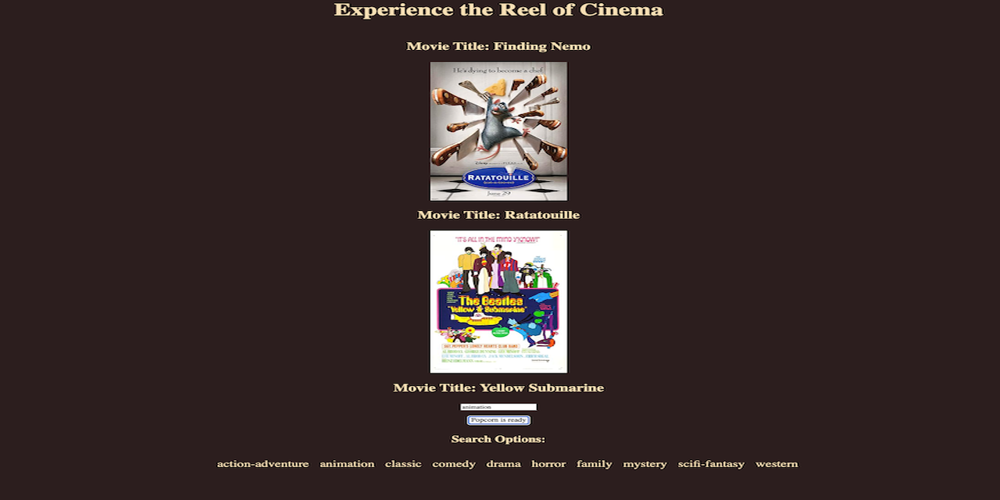

# 📽️ Reel-Pick

**Reel-Pick** is a movie picker web app that randomly recommends films with their posters using The Movie Database (TMDb) API. For movie fans everywhere 🎬

Check it out live 👉 [ReelPick](https://reelpick.netlify.app/) 
---

## 🧠 About The Project

**Reel-Pick** is a clean and simple web app that fetches and displays a random movie from TMDb’s vast catalog. Whether you're indecisive or just looking for your next watch, Reel-Pick provides a visual and interactive experience to make movie selection fun again.

### 🔥 Tech Stack

- HTML  
- CSS  
- JavaScript  
- TMDb API

---

## 📸 Screenshots

 

---

## 📄 License

Distributed under the MIT License. See `LICENSE` for more information.

---

## 🙋‍♂️ Contact

**Azeez Olaosebikan**  
[LinkedIn](https://www.linkedin.com/in/azeezolaosebikan)  
[GitHub](https://github.com/ozazeez)

---
